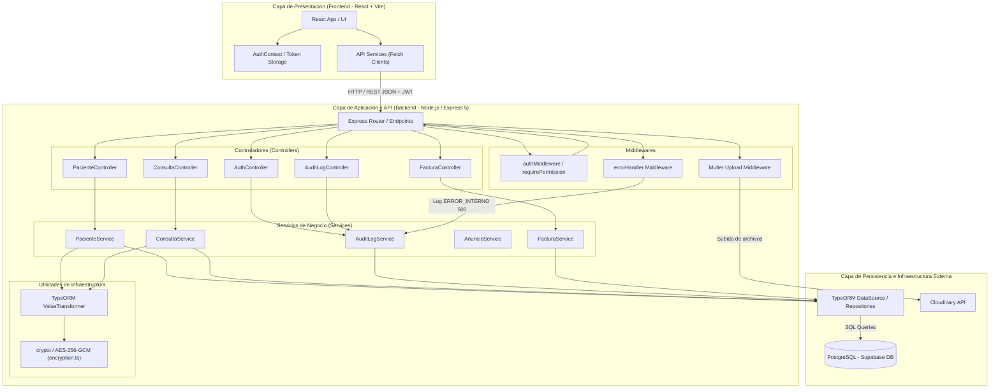
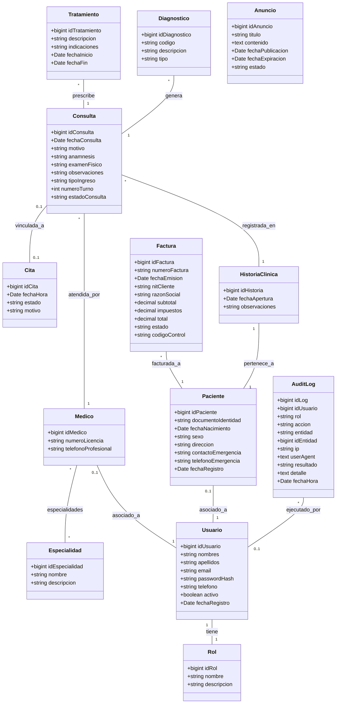
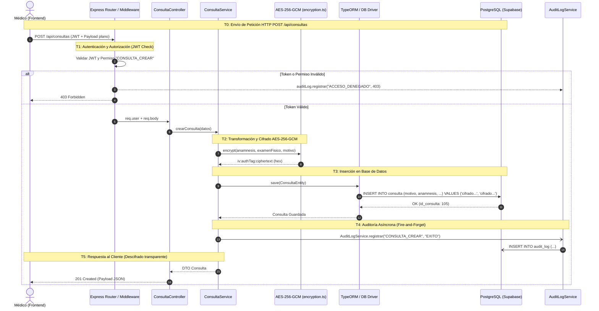

# Documentación de Arquitectura y Diagramas UML — MedicalSys

Este documento contiene la representación visual en sintaxis **Mermaid** (compatible con GitHub, GitLab y Antigravity) de los tres diagramas principales del sistema **MedicalSys**:

1. **Diagrama de Componentes (Arquitectura)**
2. **Modelado UML (Diagrama de Clases del Dominio)**
3. **Diagrama de Tiempos y Secuencia (Ciclo de Vida de Petición con Auditoría y Cifrado)**

---

## 1. Diagrama de Componentes (Component Diagram)

El siguiente diagrama detalla la arquitectura de software de **MedicalSys**, mostrando la separación de capas entre el cliente React, los controladores y middlewares de Express, los servicios de aplicación, el ORM TypeORM con sus utilidades (cifrado AES-256-GCM) y los componentes de infraestructura persistente.

---

## 2. Modelado UML — Diagrama de Clases (Class Diagram)

Modelado completo del dominio de **MedicalSys**, incluyendo entidades de usuarios y seguridad, módulo clínico, facturación, zona de anuncios y la entidad de auditoría `AuditLog` (HU-39).

---

## 3. Diagrama de Tiempos y Secuencia (Timing / Sequence Diagram)

Representación del **ciclo de vida en el tiempo** de una petición sensible (ej. Registro de consulta médica con datos cifrados en HU-38 y registro de auditoría en HU-39).

---

### Resumen de Cumplimiento

- ✅ **Diagrama de Componentes**: Muestra la arquitectura en capas (React Front, Controllers/Middlewares Express, Cifrado AES, AuditLogService, TypeORM y PostgreSQL).
- ✅ **Modelado UML**: Diagrama de clases completo del dominio del sistema incluyendo las relaciones entre `Usuario`, `Paciente`, `Medico`, `Consulta`, `Diagnostico`, `Tratamiento`, `Factura`, `Anuncio` y `AuditLog`.
- ✅ **Diagrama de Tiempos / Secuencia**: Ilustra la secuencia temporal $T_0 \to T_5$ desde que el usuario envía una petición HTTP hasta el cifrado de datos, persistencia en BD y registro asíncrono de auditoría.
