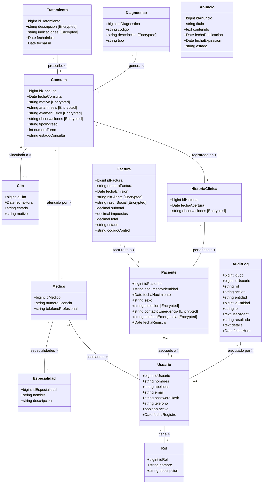
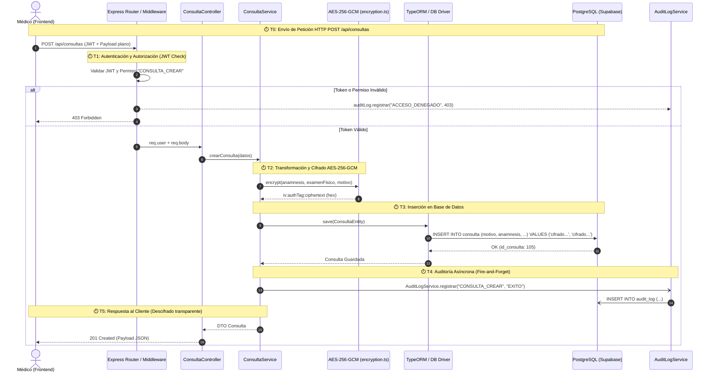

# Documentación de Arquitectura y Diagramas UML — MedicalSys (Sprint 5)

Este documento contiene los tres diagramas principales del sistema **MedicalSys** estructurados en sintaxis **Mermaid**:

1. **Diagrama de Componentes (Arquitectura general)**
2. **Modelado UML (Diagrama de Clases del Dominio)**
3. **Diagrama de Tiempos y Secuencia (Ciclo de Vida con Cifrado HU-38 y Auditoría HU-39)**

---

## 1. Diagrama de Componentes (Component Diagram)

```mermaid
componentDiagram
    package "Capa de Presentación (Frontend - React + Vite)" {
        [React App / UI] as UI
        [AuthContext / Token Storage] as AuthCtx
        [API Services (Fetch Clients)] as APIClients
    }

    package "Capa de Aplicación y API (Backend - Node.js / Express 5)" {
        [Express Router / Endpoints] as Router
        
        package "Middlewares" {
            [authMiddleware / requirePermission] as AuthMw
            [errorHandler Middleware] as ErrorMw
            [Multer Upload Middleware] as UploadMw
        }
        
        package "Controladores (Controllers)" {
            [AuthController] as AuthCtrl
            [PacienteController] as PacienteCtrl
            [ConsultaController] as ConsultaCtrl
            [AuditLogController] as AuditCtrl
            [FacturaController] as FacturaCtrl
        }
        
        package "Servicios de Negocio (Services)" {
            [PacienteService] as PacienteSvc
            [ConsultaService] as ConsultaSvc
            [AuditLogService] as AuditSvc
            [AnuncioService] as AnuncioSvc
            [FacturaService] as FacturaSvc
        }

        package "Utilidades de Infraestructura" {
            [crypto / AES-256-GCM (encryption.ts)] as CryptoUtil
            [TypeORM ValueTransformer] as EncTransformer
        }
    }

    package "Capa de Persistencia e Infraestructura Externa" {
        [TypeORM DataSource / Repositories] as TypeORM
        database "PostgreSQL (Supabase DB)" as PostgresDB {
            [Tablas: paciente, consulta, audit_log, etc.] as Tables
        }
        cloud "Cloudinary API" as Cloudinary
    }

    UI --> AuthCtx
    UI --> APIClients
    APIClients --> Router : HTTP / REST (JSON + JWT)

    Router --> AuthMw
    AuthMw --> Router
    Router --> UploadMw
    Router --> AuthCtrl
    Router --> PacienteCtrl
    Router --> ConsultaCtrl
    Router --> AuditCtrl
    Router --> FacturaCtrl
    Router --> ErrorMw

    AuthCtrl --> AuditSvc
    PacienteCtrl --> PacienteSvc
    ConsultaCtrl --> ConsultaSvc
    AuditCtrl --> AuditSvc
    FacturaCtrl --> FacturaSvc

    PacienteSvc --> EncTransformer
    ConsultaSvc --> EncTransformer
    EncTransformer --> CryptoUtil
    ErrorMw --> AuditSvc : Log ERROR_INTERNO (500)

    PacienteSvc --> TypeORM
    ConsultaSvc --> TypeORM
    AuditSvc --> TypeORM
    FacturaSvc --> TypeORM
    TypeORM --> Tables : SQL Queries
    UploadMw --> Cloudinary : Subida de archivos
```

---

## 2. Modelado UML — Diagrama de Clases (Class Diagram)



---

## 3. Diagrama de Tiempos y Secuencia (Timing / Sequence Diagram)

