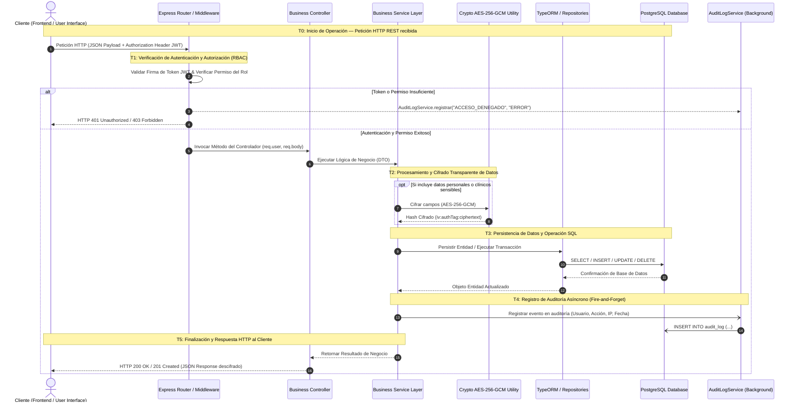

# Documentación de Arquitectura y Diagramas UML — MedicalSys

Este documento contiene la representación visual en sintaxis **Mermaid** (compatible con GitHub, GitLab y Antigravity) de los tres diagramas generales del sistema **MedicalSys**:

1. **Diagrama de Componentes (Arquitectura General del Sistema)**
2. **Modelado UML (Diagrama de Clases del Dominio Completo)**
3. **Diagrama de Tiempos y Secuencia (Ciclo de Vida General de Peticiones en el Sistema)**

---

## 1. Diagrama de Componentes (Component Diagram)

El siguiente diagrama detalla la arquitectura de software general de **MedicalSys**, mostrando la separación de capas entre la aplicación cliente React, los controladores y middlewares de Express 5, todos los servicios de negocio del sistema, la persisencia con TypeORM/PostgreSQL y los servicios externos de infraestructura.

```mermaid
flowchart TB
    subgraph Front["Capa de Presentación (Frontend - React + Vite)"]
        UI["React App / Single Page Application"]
        AuthCtx["AuthContext / Estado Global y Token JWT"]
        APIClients["Clientes HTTP / API Services"]
    end

    subgraph Back["Capa de Aplicación y API (Backend - Node.js / Express 5)"]
        Router["Express Router / Mapeo de Rutas REST"]
        
        subgraph Middlewares["Middlewares Transversales"]
            AuthMw["authMiddleware (Autenticación JWT)"]
            PermMw["requirePermission (RBAC Autorización)"]
            ErrorMw["errorHandler Middleware (Manejo de Errores y Logs)"]
            UploadMw["Multer Middleware (Subida de Documentos)"]
        end
        
        subgraph Controllers["Controladores de la API (Controllers)"]
            AuthCtrl["AuthController"]
            PacienteCtrl["PacienteController"]
            MedicoCtrl["MedicoController"]
            CitasCtrl["CitasController"]
            ConsultaCtrl["ConsultaController"]
            HistoriaCtrl["HistoriaClinicaController"]
            FacturaCtrl["FacturaController"]
            AnunciosCtrl["AnuncioController"]
            NotifCtrl["NotificacionController"]
            AuditCtrl["AuditLogController"]
        end
        
        subgraph Services["Servicios de Negocio (Services)"]
            AuthSvc["AuthService"]
            PacienteSvc["PacienteService"]
            MedicoSvc["MedicoService"]
            CitasSvc["CitaService"]
            ConsultaSvc["ConsultaService"]
            HistoriaSvc["HistoriaClinicaService"]
            FacturaSvc["FacturaService"]
            AnuncioSvc["AnuncioService"]
            NotifSvc["NotificacionService"]
            AuditSvc["AuditLogService"]
        end

        subgraph Utils["Utilidades de Infraestructura"]
            CryptoUtil["crypto / AES-256-GCM (Módulo Cifrado)"]
            EncTransformer["TypeORM ValueTransformer (Cifrado Transparente)"]
        end
    end

    subgraph Infra["Capa de Persistencia e Infraestructura Externa"]
        TypeORM["TypeORM DataSource / ORM Layer"]
        PostgresDB[("PostgreSQL Database - Supabase")]
        Cloudinary["Cloudinary API (Almacenamiento de Archivos)"]
    end

    UI --> AuthCtx
    UI --> APIClients
    APIClients -->|Peticiones HTTP REST + JWT| Router

    Router --> AuthMw
    AuthMw --> PermMw
    PermMw --> Router
    Router --> UploadMw
    
    Router --> AuthCtrl
    Router --> PacienteCtrl
    Router --> MedicoCtrl
    Router --> CitasCtrl
    Router --> ConsultaCtrl
    Router --> HistoriaCtrl
    Router --> FacturaCtrl
    Router --> AnunciosCtrl
    Router --> NotifCtrl
    Router --> AuditCtrl
    Router --> ErrorMw

    AuthCtrl --> AuthSvc
    PacienteCtrl --> PacienteSvc
    MedicoCtrl --> MedicoSvc
    CitasCtrl --> CitasSvc
    ConsultaCtrl --> ConsultaSvc
    HistoriaCtrl --> HistoriaSvc
    FacturaCtrl --> FacturaSvc
    AnunciosCtrl --> AnuncioSvc
    NotifCtrl --> NotifSvc
    AuditCtrl --> AuditSvc

    AuthSvc --> AuditSvc
    PacienteSvc --> EncTransformer
    ConsultaSvc --> EncTransformer
    FacturaSvc --> EncTransformer
    HistoriaSvc --> EncTransformer
    EncTransformer --> CryptoUtil
    ErrorMw -->|Registro automático de errores 500| AuditSvc

    AuthSvc --> TypeORM
    PacienteSvc --> TypeORM
    MedicoSvc --> TypeORM
    CitasSvc --> TypeORM
    ConsultaSvc --> TypeORM
    HistoriaSvc --> TypeORM
    FacturaSvc --> TypeORM
    AnuncioSvc --> TypeORM
    NotifSvc --> TypeORM
    AuditSvc --> TypeORM

    TypeORM -->|Consultas SQL / Transacciones| PostgresDB
    UploadMw -->|Subida de adjuntos y firmas| Cloudinary
```



---

## 2. Modelado UML — Diagrama de Clases del Dominio Completo (Class Diagram)

Modelado completo de todas las clases del modelo de datos de **MedicalSys**, incluyendo usuarios, roles, pacientes, médicos, historia clínica, consultas, diagnósticos, tratamientos, citas, facturación, anuncios, notificaciones y auditoría.

```mermaid
classDiagram
    class Usuario {
        +bigint idUsuario
        +string nombres
        +string apellidos
        +string email
        +string passwordHash
        +string telefono
        +boolean activo
        +Date fechaRegistro
    }

    class Rol {
        +bigint idRol
        +string nombre
        +string descripcion
    }

    class Paciente {
        +bigint idPaciente
        +string documentoIdentidad
        +Date fechaNacimiento
        +string sexo
        +string direccion
        +string contactoEmergencia
        +string telefonoEmergencia
        +Date fechaRegistro
    }

    class Medico {
        +bigint idMedico
        +string numeroLicencia
        +string telefonoProfesional
    }

    class Especialidad {
        +bigint idEspecialidad
        +string nombre
        +string descripcion
    }

    class HistoriaClinica {
        +bigint idHistoria
        +Date fechaApertura
        +string observaciones
    }

    class Consulta {
        +bigint idConsulta
        +Date fechaConsulta
        +string motivo
        +string anamnesis
        +string examenFisico
        +string observaciones
        +string tipoIngreso
        +int numeroTurno
        +string estadoConsulta
    }

    class Diagnostico {
        +bigint idDiagnostico
        +string codigo
        +string descripcion
        +string tipo
    }

    class Tratamiento {
        +bigint idTratamiento
        +string descripcion
        +string indicaciones
        +Date fechaInicio
        +Date fechaFin
    }

    class Cita {
        +bigint idCita
        +Date fechaHora
        +string estado
        +string motivo
    }

    class Consultorio {
        +bigint idConsultorio
        +string numero
        +string ubicacion
    }

    class Factura {
        +bigint idFactura
        +string numeroFactura
        +Date fechaEmision
        +string nitCliente
        +string razonSocial
        +decimal subtotal
        +decimal impuestos
        +decimal total
        +string estado
        +string codigoControl
    }

    class DetalleFactura {
        +bigint idDetalle
        +string concepto
        +int cantidad
        +decimal precioUnitario
        +decimal subtotal
    }

    class Consentimiento {
        +bigint idConsentimiento
        +string tipo
        +string firmadoPor
        +string estado
        +Date fechaFirma
    }

    class Documento {
        +bigint idDocumento
        +string nombreArchivo
        +string storageKey
        +string tipo
    }

    class AuditLog {
        +bigint idLog
        +bigint idUsuario
        +string rol
        +string accion
        +string entidad
        +bigint idEntidad
        +string ip
        +text userAgent
        +string resultado
        +text detalle
        +Date fechaHora
    }

    class Anuncio {
        +bigint idAnuncio
        +string titulo
        +text contenido
        +Date fechaPublicacion
        +Date fechaExpiracion
        +string estado
    }

    class Notificacion {
        +bigint idNotificacion
        +string canal
        +string tipo
        +text mensaje
        +string estado
        +Date fechaProgramada
        +Date fechaEnvio
    }

    ' Relaciones entre Clases del Dominio
    Usuario "1" -- "1" Rol : posee
    Paciente "0..1" -- "1" Usuario : cuenta_usuario
    Medico "0..1" -- "1" Usuario : cuenta_usuario
    Medico "*" -- "*" Especialidad : especialidades
    HistoriaClinica "1" -- "1" Paciente : historial_de
    Consulta "*" -- "1" HistoriaClinica : pertenece_a
    Consulta "*" -- "1" Medico : atendida_por
    Consulta "0..1" -- "0..1" Consultorio : realizada_en
    Consulta "0..1" -- "0..1" Cita : originada_por
    Diagnostico "*" -- "1" Consulta : diagnostica
    Tratamiento "*" -- "1" Consulta : receta
    Cita "*" -- "1" Paciente : reservada_por
    Cita "*" -- "1" Medico : agendada_con
    Consentimiento "*" -- "1" Paciente : firmado_por
    Documento "*" -- "0..1" Consulta : adjunto_a
    Factura "*" -- "1" Paciente : emitida_a
    Factura "1" -- "*" DetalleFactura : contiene
    Notificacion "*" -- "1" Usuario : destinada_a
    AuditLog "*" -- "0..1" Usuario : registrado_por
```

---

## 3. Diagrama de Tiempos y Secuencia (Timing / Sequence Diagram)

Representación del **ciclo de vida general de una petición HTTP** en el sistema **MedicalSys**, ilustrando los tiempos de ejecución $T_0 \to T_5$ a través de autenticación JWT, verificación de permisos RBAC, ejecución de la lógica de negocio, cifrado automático de datos sensibles, persistencia SQL y auditoría asíncrona.

